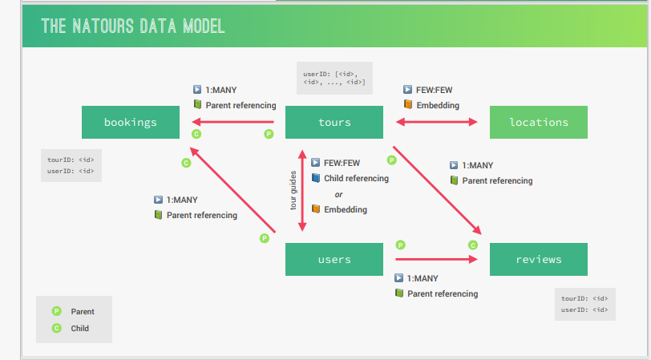

## Data Modelling

### Data Modelling Concepts
1. Types of relationships
    - 1:1
    - 1:MANY   [1:FEW 1:MANY 1:TON]
    - MANY:MANY
2. When to Embed and When to Reference

    | POC | EMBED | REFERENCE |
    | ------- | -------- | ------- |
    | RelationShip | 1:FEW  1:MANY | 1:MANY  1:TON  MANY:MANY |
    | Data Access Pattern | DO NOT CHANGE A LOT | UPDATED A LOT |
    | Data Closeness |  Data really belong together (user+email) | we frequently need to query both datasets on their own |

3. Types of referencing
    - Child Referencing
    - Parent Referencing
    - Two-Way Referencing

Note: Document size is **16M** that's why in 1:TON we must apply  Referencing


### Data Model for our System


    1. Start with the data set entities in our system [Tours Users Locations Reviews Bookings] 
### Code Map
1. Geospatial Data
    - <a href="">GeoJson</a>
2. <a href="">Tour Modeling: Embedding</a>
    **We pass in the body of the request the IDs just use middleware to embed the guides data into the Tour Document**
    <a href="">Implement Pre save middle ware to embed the tours</a>
3. <a href="">Tour Modeling: Child referencing</a>
4. <a href="">Populating References</a>
5. Parent referencing the parent doesn't know its children so we need<a href="">virtual Population </a>
6. <a href="">Nested Routes</a>
### PostMan Hints
1. Globals Refer to postman
2. Environment Lect 133
3. Copying Token from response to headers of protected routes Lect 133
```
pm.environment.set("jwt", pm.response.json().token);
```


### NPM Packages
1. Encrypt Passwords
```
npm i bcryptjs
```
2. JWT
```
npm i jsonwebtoken
```
3. Node Mailer to send emails
```
npm in nodemailer
```
4. Rate limiting
```
npm i express-rate-limit
```
5. Helmet
```
npm i helmet
```
6. Mongo Sanitize to prevent NoSQL attack
```
npm i express-mongo-sanitize
```
7. xss-clean to prevent xss attack
```
npm xss-clean
```
8. http parameter pollution package
```
npm i hpp
```